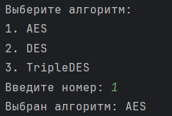
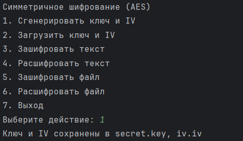
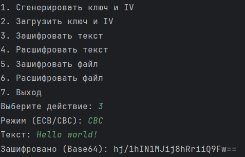
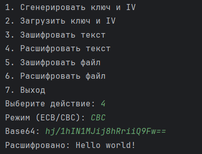
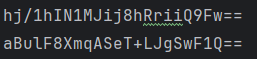
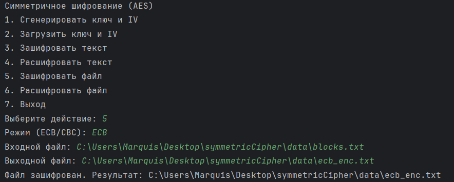
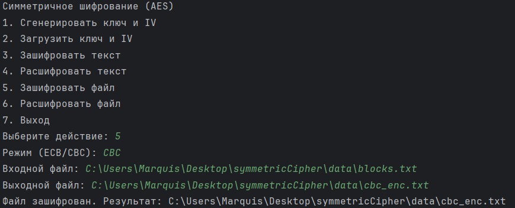
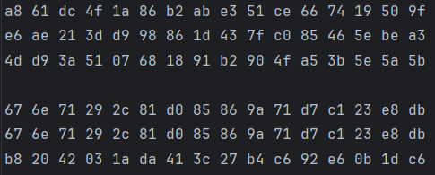

### 1. Выбор алгоритма шифрования  
После запуска программы выбираем алгоритм (например, **AES** – вводим `1`). Программа выводит подтверждение выбора.

---

### 2. Генерация ключа и IV  
В главном меню выбираем пункт **1. Сгенерировать ключ и IV**.  
Программа создаёт случайный ключ и IV, сохраняет их в файлы `secret.key` и `iv.iv`.

---

### 3. Шифрование текста (режим CBC)  
Выбираем **3. Зашифровать текст**.  
Вводим текст.  
Вводим режим `CBC`.  
Программа выводит зашифрованный текст в формате Base64.

---

### 4. Расшифровка текста (режим CBC)  
Выбираем **4. Расшифровать текст**.  
Вставляем полученный Base64, снова указываем режим `CBC`.  
Программа восстанавливает исходный текст.

---

### 5. Одинаковый ключ, разные IV → разный шифротекст  
- Генерируем новый IV.  
- Шифруем то же сообщение с тем же ключом, но новым IV.  
- Сравниваем результаты – они разные.

*На скриншоте*: два результата шифрования одного текста с одним ключом, но разными IV.

---

### 6. Шифрование файла (ECB) с повторяющимися блоками  
**Подготовка:** создаём текстовый файл `blocks.txt`, содержащий 32 одинаковых символа `A`.  
Выбираем **5. Зашифровать файл**.  
Входной файл: `blocks.txt`, выходной: `ecb_enc.txt`, режим `ECB`.

---

### 7. Шифрование файла (CBC) с повторяющимися блоками  
Тот же файл `blocks.txt` шифруем в режиме **CBC**, выходной файл `cbc_enc.txt`.

---

### 8. Демонстрация различий ECB и CBC (сравнение блоков)  
Декодируем оба шифротекста из Base64 в **hex**.
Разбиваем hex-строки на блоки по 16 байт.  

- В режиме ECB первые два блока (соответствующие двум блокам `A`) **идентичны**.  
- В режиме CBC все блоки **различны**.
- 
*На скриншоте*: hex-представление.

---
